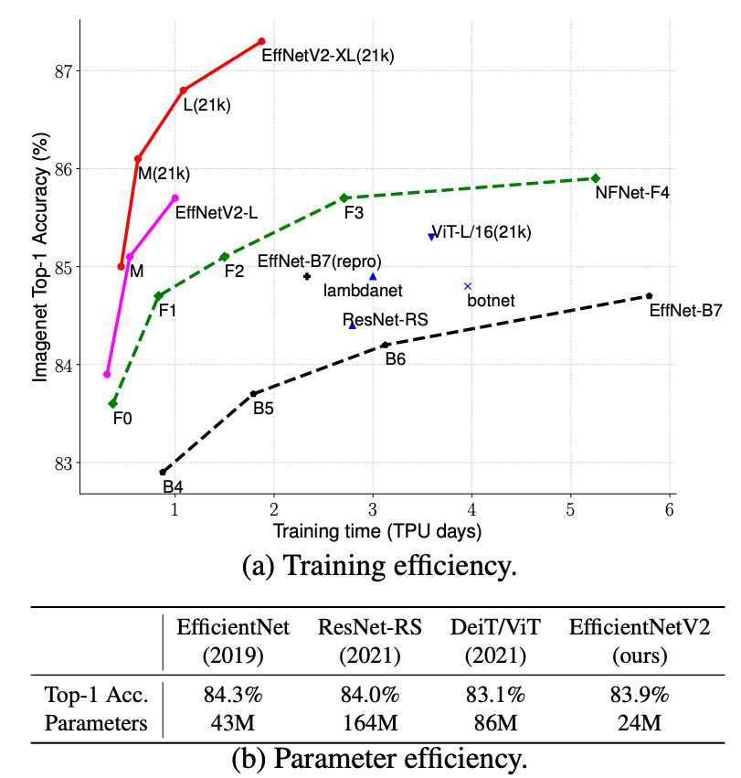
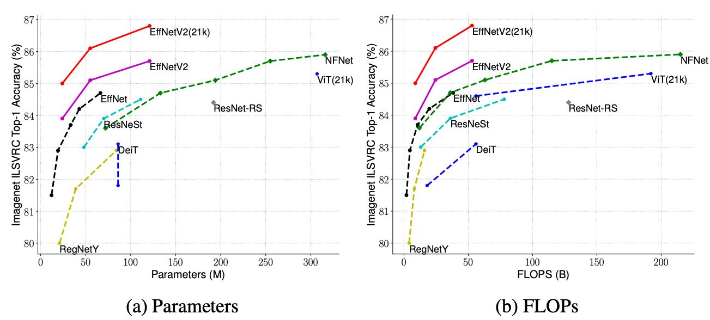

# EfficientNetV2

> [EfficientNetV2: Smaller Models and Faster Training](https://arxiv.org/abs/2104.00298)

<!-- [ALGORITHM] -->

## Introduction

[EfficientNetV2](https://arxiv.org/abs/2104.00298) are a family of image classification models, which achieve better parameter efficiency and faster training speed than prior arts.  Built upon [EfficientNetV1](https://arxiv.org/abs/1905.11946), our EfficientNetV2 models use neural architecture search (NAS) to jointly optimize model size and training speed, and are scaled up in a way for faster training and inference speed.



Here are the comparison on parameters and flops:



## Abstract

<details>

<summary>Click to show the detailed Abstract</summary>

<br>
This paper introduces EfficientNetV2, a new family of convolutional networks that have faster training speed and better parameter efficiency than previous models. To develop this family of models, we use a combination of training-aware neural architecture search and scaling, to jointly optimize training speed and parameter efficiency. The models were searched from the search space enriched with new ops such as Fused-MBConv. Our experiments show that EfficientNetV2 models train much faster than state-of-the-art models while being up to 6.8x smaller.
Our training can be further sped up by progressively increasing the image size during training, but it often causes a drop in accuracy. To compensate for this accuracy drop, we propose to adaptively adjust regularization (e.g., dropout and data augmentation) as well, such that we can achieve both fast training and good accuracy.
With progressive learning, our EfficientNetV2 significantly outperforms previous models on ImageNet and CIFAR/Cars/Flowers datasets. By pretraining on the same ImageNet21k, our EfficientNetV2 achieves 87.3% top-1 accuracy on ImageNet ILSVRC2012, outperforming the recent ViT by 2.0% accuracy while training 5x-11x faster using the same computing resources. Code will be available at this https URL.

</details>

## Results and models

### ImageNet-1k

In the result table


## How to use it?

<!-- [TABS-BEGIN] -->

**Predict image**

```python
>>> import torch
>>> from mmcls.apis import init_model, inference_model
>>>
>>> model = init_model('configs/efficientnet/efficientnet-b0_8xb32_in1k.py', "https://download.openmmlab.com/mmclassification/v0/efficientnet/efficientnet-b0_3rdparty_8xb32_in1k_20220119-a7e2a0b1.pth")
>>> predict = inference_model(model, 'demo/demo.JPEG')
>>> print(predict['pred_class'])
sea snake
>>> print(predict['pred_score'])
0.6968820691108704
```

**Use the model**

```python
>>> import torch
>>> from mmcls.apis import init_model
>>>
>>> model = init_model('configs/efficientnet_v2/efficientnet_v2-b0_8xb32_in1k.py', "")
>>> inputs = torch.rand(1, 3, 224, 224).to(model.data_preprocessor.device)
>>> # To get classification scores.
>>> out = model(inputs)
>>> print(out.shape)
torch.Size([1, 1000])
>>> # To extract features.
>>> outs = model.extract_feat(inputs)
>>> print(outs[0].shape)
torch.Size([1, 1280])
```

**Train/Test Command**

Place the ImageNet dataset to the `data/imagenet/` directory, or prepare datasets according to the [docs](https://mmclassification.readthedocs.io/en/1.x/user_guides/dataset_prepare.html#prepare-dataset).

Train:

```shell
python tools/train.py configs/efficientnet_v2/efficientnet_v2-b0_8xb32_in1k.py
```

Test:

```shell
python tools/test.py configs/efficientnet_v2/efficientnet_v2-b0_8xb32_in1k.py
```

<!-- [TABS-END] -->

For more configurable parameters, please refer to the [API](https://mmclassification.readthedocs.io/en/1.x/api/generated/mmcls.models.backbones.EfficientNet.html#mmcls.models.backbones.EfficientNet).

## Citation

```
@inproceedings{tan2021efficientnetv2,
  title={Efficientnetv2: Smaller models and faster training},
  author={Tan, Mingxing and Le, Quoc},
  booktitle={International Conference on Machine Learning},
  pages={10096--10106},
  year={2021},
  organization={PMLR}
}
```

