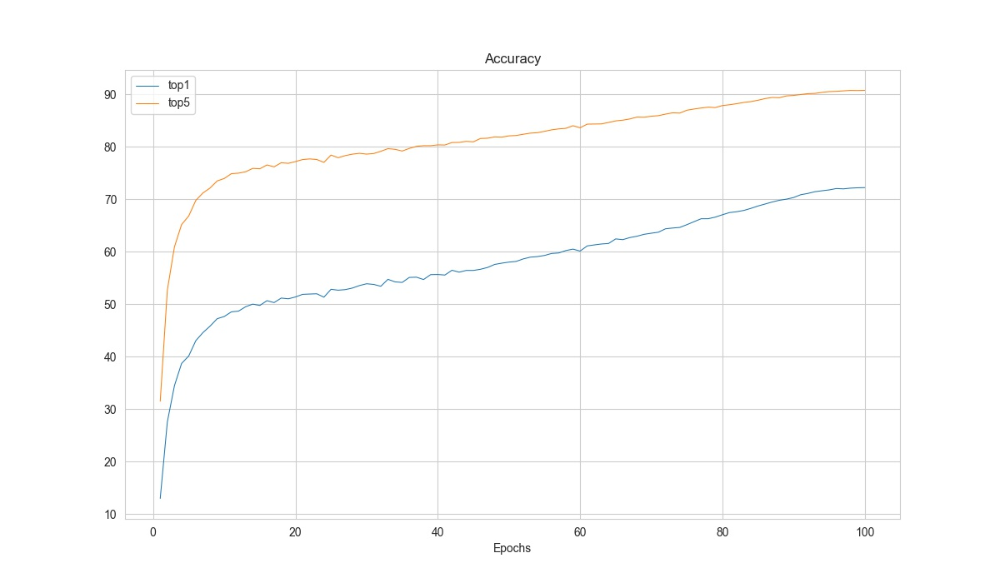

# Log and Results Analysis

## Log Analysis

### Introduction of log analysis tool

`tools/analysis_tools/analyze_logs.py` plots curves of given keys according to the log files.

<div align=center></div>

```shell
python tools/analysis_tools/analyze_logs.py plot_curve  \
    ${JSON_LOGS}  \
    [--keys ${KEYS}]  \
    [--title ${TITLE}]  \
    [--legend ${LEGEND}]  \
    [--backend ${BACKEND}]  \
    [--style ${STYLE}]  \
    [--out ${OUT_FILE}]  \
    [--window-size ${WINDOW_SIZE}]
```

**Description of all arguments**：

- `json_logs` : The paths of the log files, separate multiple files by spaces.
- `--keys` : The fields of the logs to analyze, separate multiple keys by spaces. Defaults to 'loss'.
- `--title` : The title of the figure. Defaults to use the filename.
- `--legend` : The names of legend, the number of which must be equal to `len(${JSON_LOGS}) * len(${KEYS})`. Defaults to use `"${JSON_LOG}-${KEYS}"`.
- `--backend` : The backend of matplotlib. Defaults to auto selected by matplotlib.
- `--style` : The style of the figure. Default to `whitegrid`.
- `--out` : The path of the output picture. If not set, the figure won't be saved.
- `--window-size`: The shape of the display window. The format should be `'W*H'`. Defaults to `'12*7'`.

```{note}
The `--style` option depends on `seaborn` package, please install it before setting it.
```

### How to plot the loss/accuracy curve

We present some examples here to show how to plot the loss curve of accuracy curve by using the `tools/analysis_tools/analyze_logs.py`

#### Plot the loss curve in training.

```shell
python tools/analysis_tools/analyze_logs.py plot_curve your_log_json --keys loss --legend loss
```

#### Plot the top-1 accuracy and top-5 accuracy curves, and save the figure to results.jpg.

```shell
python tools/analysis_tools/analyze_logs.py plot_curve your_log_json --keys accuracy/top1 accuracy/top5  --legend top1 top5 --out results.jpg
```

#### Compare the top-1 accuracy of two log files in the same figure.

```shell
python tools/analysis_tools/analyze_logs.py plot_curve log1.json log2.json --keys accuracy/top1 --legend exp1 exp2
```

### How to calculate training time

`tools/analysis_tools/analyze_logs.py` can also calculate the training time according to the log files.

```shell
python tools/analysis_tools/analyze_logs.py cal_train_time \
    ${JSON_LOGS}
    [--include-outliers]
```

**Description of all arguments**:

- `json_logs` : The paths of the log files, separate multiple files by spaces.
- `--include-outliers` : If set, include the first time record in each epoch (Sometimes the time of the first iteration is longer).

Example:

```shell
python tools/analysis_tools/analyze_logs.py cal_train_time work_dirs/your_exp/20230206_181002/vis_data/scalars.json
```

The output is expected to be like the below.

```text
-----Analyze train time of work_dirs/your_exp/20230206_181002/vis_data/scalars.json-----
slowest epoch 68, average time is 0.3818
fastest epoch 1, average time is 0.3694
time std over epochs is 0.0020
average iter time: 0.3777 s/iter
```

## Result Analysis

With the `--out` argument in `tools/test.py`, we can save the inference results of all samples as a file.
And with this result file, we can do further analysis.

### How to conduct offline metric evaluation

We provide `tools/analysis_tools/eval_metric.py` to enable the user evaluate the model from the prediction files.

```shell
python tools/analysis_tools/eval_metric.py \
      ${RESULT} \
      [--metric ${METRIC_OPTIONS} ...]
```

Description of all arguments:

- `result`:  The output result file in pickle format from `tools/test.py`.
- `--metric`: The metric and options to evaluate the results. You need to specify at least one metric and you
  can also specify multiple `--metric` to use multiple metrics.

Please refer the [Metric Documentation](mmpretrain.evaluation) to find the available metrics and options.

```{note}
In `tools/test.py`, we support using `--out-item` option to select which kind of results will be saved.
Please ensure the `--out-item` is not specified or `--out-item=pred` to use this tool.
```

**Examples**:

```shell
# Get the prediction results
python tools/test.py configs/resnet/resnet18_8xb16_cifar10.py \
    https://download.openmmlab.com/mmclassification/v0/resnet/resnet18_b16x8_cifar10_20210528-bd6371c8.pth \
    --out results.pkl

# Eval the top-1 and top-5 accuracy
python tools/analysis_tools/eval_metric.py results.pkl --metric type=Accuracy topk=1,5

# Eval the overall accuracy and the class-wise precision, recall, f1-score
python tools/analysis_tools/eval_metric.py results.pkl --metric type=Accuracy \
    --metric type=SingleLabelMetric items=precision,recall,f1-score average=None
```

### How to plot the confusion matrix for the test result

We provide `tools/analysis_tools/confusion_matrix.py` to enable the user plot the confusion matrix from the prediction files.

```shell
python tools/analysis_tools/confusion_matrix.py \
      ${CONFIG} \
      ${RESULT} \
      [--out ${OUT}] \
      [--show] \
      [--show-path ${SHOW_PATH}] \
      [--include-values] \
      [--cmap] \
      [--cfg-options ${CFG_OPTIONS} ...] \
```

Description of all arguments:

- `config`: The config file path.
- `result`:  The output result file in pickle format from `tools/test.py`, or a checkpoint file.
- `--out`: The path to save the confusion matrix in pickle format.
- `--show`: Whether to show the confusion matrix plot.
- `--show-path`: The path to save the confusion matrix plot.
- `--include-values`: Whether to show the values in the confusion matrix plot.
- `--cmap`: The color map to plot the confusion matrix.
- `--cfg-options`: If specified, the key-value pair config will be merged into the config file, for more details please refer to [Learn about Configs](../user_guides/config.md)

```{note}
In `tools/test.py`, we support using `--out-item` option to select which kind of results will be saved.
Please ensure the `--out-item` is not specified or `--out-item=pred` to use this tool.
```

**Examples**:

```shell
# Get the prediction results
python tools/test.py configs/resnet/resnet18_8xb16_cifar10.py \
    https://download.openmmlab.com/mmclassification/v0/resnet/resnet18_b16x8_cifar10_20210528-bd6371c8.pth \
    --out results.pkl

# Save the confusion matrix in a pickle file
python tools/analysis_tools/confusion_matrix.py configs/resnet/resnet18_8xb16_cifar10.py results.pkl --out cm.pkl

# Show the confusion matrix plot in a graphical window.
python tools/analysis_tools/confusion_matrix.py configs/resnet/resnet18_8xb16_cifar10.py results.pkl --show
```

### How to visualize the prediction results

We can use `tools/analysis_tools/analyze_results.py` to save the images with the highest scores in successful or failed prediction.

```shell
python tools/analysis_tools/analyze_results.py \
      ${CONFIG} \
      ${RESULT} \
      [--out-dir ${OUT_DIR}] \
      [--topk ${TOPK}] \
      [--rescale-factor ${RESCALE_FACTOR}] \
      [--cfg-options ${CFG_OPTIONS}]
```

**Description of all arguments**:

- `config` : The path of the model config file.
- `result`:  Output result file in json/pickle format from `tools/test.py`.
- `--out_dir`: Directory to store output files.
- `--topk`: The number of images in successful or failed prediction with the highest `topk` scores to save. If not specified, it will be set to 20.
- `--rescale-factor`: Image rescale factor, which is useful if the output is too large or too small (Too small
  images may cause the prediction tag is too vague).
- `--cfg-options`: If specified, the key-value pair config will be merged into the config file, for more details please refer to [Learn about Configs](../user_guides/config.md)

```{note}
In `tools/test.py`, we support using `--out-item` option to select which kind of results will be saved.
Please ensure the `--out-item` is not specified or `--out-item=pred` to use this tool.
```

**Examples**:

```shell
# Get the prediction results
python tools/test.py configs/resnet/resnet18_8xb16_cifar10.py \
    https://download.openmmlab.com/mmclassification/v0/resnet/resnet18_b16x8_cifar10_20210528-bd6371c8.pth \
    --out results.pkl

# Save the top-10 successful and failed predictions. And enlarge the sample images by 10 times.
python tools/analysis_tools/analyze_results.py \
       configs/resnet/resnet18_8xb16_cifar10.py \
       results.pkl \
       --out-dir output \
       --topk 10 \
       --rescale-factor 10
```
