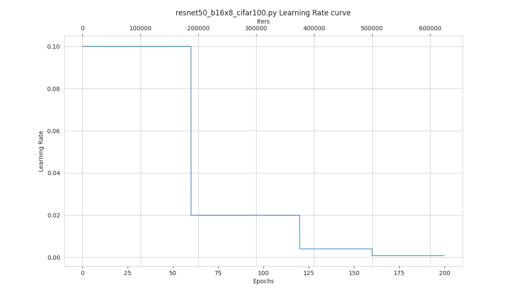

# Visualization

<!-- TOC -->

- [Pipeline Visualization](#pipeline-visualization)
- [Learning Rate Schedule Visualization](#learning-rate-schedule-visualization)
- [Class Activation Map Visualization](#class-activation-map-visualization)
- [FAQs](#faqs)

<!-- TOC -->

## Pipeline Visualization

```bash
python tools/visualizations/vis_pipeline.py \
    ${CONFIG_FILE} \
    [--output-dir ${OUTPUT_DIR}] \
    [--phase ${DATASET_PHASE}] \
    [--number ${BUNBER_IMAGES_DISPLAY}] \
    [--skip-type ${SKIP_TRANSFORM_TYPE}] \
    [--mode ${DISPLAY_MODE}] \
    [--show] \
    [--adaptive] \
    [--min-edge-length ${MIN_EDGE_LENGTH}] \
    [--max-edge-length ${MAX_EDGE_LENGTH}] \
    [--bgr2rgb] \
    [--window-size ${WINDOW_SIZE}] \
    [--cfg-options ${CFG_OPTIONS}]
```

**Description of all arguments**：

- `config` : The path of a model config file.
- `--output-dir`: The output path for visualized images. If not specified, it will be set to `''`, which means not to save.
- `--phase`: Phase of visualizing dataset，must be one of `[train, val, test]`. If not specified, it will be set to `train`.
- `--number`: The number of samples to visualized. If not specified, display all images in the dataset.
- `--skip-type`: The pipelines to be skipped. If not specified, it will be set to `['ToTensor', 'Normalize', 'ImageToTensor', 'Collect']`.
- `--mode`: The display mode, can be one of `[original, pipeline, concat]`. If not specified, it will be set to `concat`.
- `--show`: If set, display pictures in pop-up windows.
- `--adaptive`: If set, adaptively resize images for better visualization.
- `--min-edge-length`: The minimum edge length, used when `--adaptive` is set. When any side of the picture is smaller than `${MIN_EDGE_LENGTH}`, the picture will be enlarged while keeping the aspect ratio unchanged, and the short side will be aligned to `${MIN_EDGE_LENGTH}`. If not specified, it will be set to 200.
- `--max-edge-length`: The maximum edge length, used when `--adaptive` is set. When any side of the picture is larger than `${MAX_EDGE_LENGTH}`, the picture will be reduced while keeping the aspect ratio unchanged, and the long side will be aligned to `${MAX_EDGE_LENGTH}`. If not specified, it will be set to 1000.
- `--bgr2rgb`: If set, flip the color channel order of images.
- `--window-size`: The shape of the display window. If not specified, it will be set to `12*7`. If used, it must be in the format `'W*H'`.
- `--cfg-options` : Modifications to the configuration file, refer to [Tutorial 1: Learn about Configs](https://mmclassification.readthedocs.io/en/latest/tutorials/config.html).

```{note}

1. If the `--mode` is not specified, it will be set to `concat` as default, get the pictures stitched together by original pictures and transformed pictures; if the `--mode` is set to `original`, get the original pictures; if the `--mode` is set to `transformed`, get the transformed pictures; if the `--mode` is set to `pipeline`, get all the intermediate images through the pipeline.

2. When `--adaptive` option is set, images that are too large or too small will be automatically adjusted, you can use `--min-edge-length` and `--max-edge-length` to set the adjust size.
```

**Examples**：

1. In **'original'** mode, visualize 100 original pictures in the `CIFAR100` validation set, then display and save them in the `./tmp` folder：

```shell
python ./tools/visualizations/vis_pipeline.py configs/resnet/resnet50_8xb16_cifar100.py --phase val --output-dir tmp --mode original --number 100  --show --adaptive --bgr2rgb
```

<div align=center></div>

2. In **'transformed'** mode, visualize all the transformed pictures of the `ImageNet` training set and display them in pop-up windows：

```shell
python ./tools/visualizations/vis_pipeline.py ./configs/resnet/resnet50_8xb32_in1k.py --show --mode transformed
```

<div align=center></div>

3. In **'concat'** mode, visualize 10 pairs of origin and transformed images for comparison in the `ImageNet` train set and save them in the `./tmp` folder：

```shell
python ./tools/visualizations/vis_pipeline.py configs/swin_transformer/swin_base_224_b16x64_300e_imagenet.py --phase train --output-dir tmp --number 10 --adaptive
```

<div align=center></div>

4. In **'pipeline'** mode, visualize all the intermediate pictures in the `ImageNet` train set through the pipeline：

```shell
python ./tools/visualizations/vis_pipeline.py configs/swin_transformer/swin_base_224_b16x64_300e_imagenet.py --phase train --adaptive --mode pipeline --show
```

<div align=center></div>

## Learning Rate Schedule Visualization

```bash
python tools/visualizations/vis_lr.py \
    ${CONFIG_FILE} \
    --dataset-size ${DATASET_SIZE} \
    --ngpus ${NUM_GPUs}
    --save-path ${SAVE_PATH} \
    --title ${TITLE} \
    --style ${STYLE} \
    --window-size ${WINDOW_SIZE}
    --cfg-options
```

**Description of all arguments**：

- `config` :  The path of a model config file.
- `dataset-size` : The size of the datasets. If set，`build_dataset` will be skipped and `${DATASET_SIZE}` will be used as the size. Default to use the function `build_dataset`.
- `ngpus` : The number of GPUs used in training, default to be 1.
- `save-path` : The learning rate curve plot save path, default not to save.
- `title` : Title of figure. If not set, default to be config file name.
- `style` : Style of plt. If not set, default to be `whitegrid`.
- `window-size`: The shape of the display window. If not specified, it will be set to `12*7`. If used, it must be in the format `'W*H'`.
- `cfg-options` : Modifications to the configuration file, refer to [Tutorial 1: Learn about Configs](https://mmclassification.readthedocs.io/en/latest/tutorials/config.html).

```{note}
Loading annotations maybe consume much time, you can directly specify the size of the dataset with `dataset-size` to save time.
```

**Examples**：

```bash
python tools/visualizations/vis_lr.py configs/resnet/resnet50_b16x8_cifar100.py
```

<div align=center></div>

When using ImageNet, directly specify the size of ImageNet, as below:

```bash
python tools/visualizations/vis_lr.py configs/repvgg/repvgg-B3g4_4xb64-autoaug-lbs-mixup-coslr-200e_in1k.py --dataset-size 1281167 --ngpus 4 --save-path ./repvgg-B3g4_4xb64-lr.jpg
```

<div align=center></div>

## Class Activation Map Visualization

MMClassification provides `tools\visualizations\vis_cam.py` tool to visualize class activation map. Please use `pip install "grad-cam>=1.3.6"` command to install [pytorch-grad-cam](https://github.com/jacobgil/pytorch-grad-cam).

The supported methods are as follows:

| Method       | What it does                                                                                                                 |
| ------------ | ---------------------------------------------------------------------------------------------------------------------------- |
| GradCAM      | Weight the 2D activations by the average gradient                                                                            |
| GradCAM++    | Like GradCAM but uses second order gradients                                                                                 |
| XGradCAM     | Like GradCAM but scale the gradients by the normalized activations                                                           |
| EigenCAM     | Takes the first principle component of the 2D Activations (no class discrimination, but seems to give great results)         |
| EigenGradCAM | Like EigenCAM but with class discrimination: First principle component of Activations\*Grad. Looks like GradCAM, but cleaner |
| LayerCAM     | Spatially weight the activations by positive gradients. Works better especially in lower layers                              |

**Command**：

```bash
python tools/visualizations/vis_cam.py \
    ${IMG} \
    ${CONFIG_FILE} \
    ${CHECKPOINT} \
    [--target-layers ${TARGET-LAYERS}] \
    [--preview-model] \
    [--method ${METHOD}] \
    [--target-category ${TARGET-CATEGORY}] \
    [--save-path ${SAVE_PATH}] \
    [--vit-like] \
    [--num-extra-tokens ${NUM-EXTRA-TOKENS}]
    [--aug_smooth] \
    [--eigen_smooth] \
    [--device ${DEVICE}] \
    [--cfg-options ${CFG-OPTIONS}]
```

**Description of all arguments**：

- `img` : The target picture path.
- `config` : The path of the model config file.
- `checkpoint` : The path of the checkpoint.
- `--target-layers` : The target layers to get activation maps, one or more network layers can be specified. If not set, use the norm layer of the last block.
- `--preview-model` : Whether to print all network layer names in the model.
- `--method` : Visualization method, supports `GradCAM`, `GradCAM++`, `XGradCAM`, `EigenCAM`, `EigenGradCAM`, `LayerCAM`, which is case insensitive. Defaults to `GradCAM`.
- `--target-category` : Target category, if not set, use the category detected by the given model.
- `--save-path` : The path to save the CAM visualization image. If not set, the CAM image will not be saved.
- `--vit-like` : Whether the network is ViT-like network.
- `--num-extra-tokens` : The number of extra tokens in ViT-like backbones. If not set, use num_extra_tokens the backbone.
- `--aug_smooth` : Whether to use TTA(Test Time Augment) to get CAM.
- `--eigen_smooth` : Whether to use the principal component to reduce noise.
- `--device` : The computing device used. Default to 'cpu'.
- `--cfg-options` : Modifications to the configuration file, refer to [Tutorial 1: Learn about Configs](https://mmclassification.readthedocs.io/en/latest/tutorials/config.html).

```{note}
The argument `--preview-model` can view all network layers names in the given model. It will be helpful if you know nothing about the model layers when setting `--target-layers`.
```

**Examples(CNN)**：

Here are some examples of `target-layers` in ResNet-50, which can be any module or layer:

- `'backbone.layer4'` means the output of the forth ResLayer.
- `'backbone.layer4.2'` means the output of the third BottleNeck block in the forth ResLayer.
- `'backbone.layer4.2.conv1'` means the output of the `conv1` layer in above BottleNeck block.

```{note}
For `ModuleList` or `Sequential`, you can also use the index to specify which sub-module is the target layer.

For example, the `backbone.layer4[-1]` is the same as `backbone.layer4.2` since `layer4` is a `Sequential` with three sub-modules.
```

1. Use different methods to visualize CAM for `ResNet50`, the `target-category` is the predicted result by the given checkpoint, using the default `target-layers`.

   ```shell
   python tools/visualizations/vis_cam.py \
       demo/bird.JPEG \
       configs/resnet/resnet50_8xb32_in1k.py \
       https://download.openmmlab.com/mmclassification/v0/resnet/resnet50_batch256_imagenet_20200708-cfb998bf.pth \
       --method GradCAM
       # GradCAM++, XGradCAM, EigenCAM, EigenGradCAM, LayerCAM
   ```

   | Image                                | GradCAM                                 | GradCAM++                                 | EigenGradCAM                                 | LayerCAM                                 |
   | ------------------------------------ | --------------------------------------- | ----------------------------------------- | -------------------------------------------- | ---------------------------------------- |
   | <div align=center></div> | <div align=center></div> | <div align=center></div> | <div align=center></div> | <div align=center></div> |

2. Use different `target-category` to get CAM from the same picture. In `ImageNet` dataset, the category 238 is 'Greater Swiss Mountain dog', the category 281 is 'tabby, tabby cat'.

   ```shell
   python tools/visualizations/vis_cam.py \
       demo/cat-dog.png configs/resnet/resnet50_8xb32_in1k.py \
       https://download.openmmlab.com/mmclassification/v0/resnet/resnet50_batch256_imagenet_20200708-cfb998bf.pth \
       --target-layers 'backbone.layer4.2' \
       --method GradCAM \
       --target-category 238
       # --target-category 281
   ```

   | Category | Image                                          | GradCAM                                          | XGradCAM                                          | LayerCAM                                          |
   | -------- | ---------------------------------------------- | ------------------------------------------------ | ------------------------------------------------- | ------------------------------------------------- |
   | Dog      | <div align=center></div> | <div align=center></div> | <div align=center></div> | <div align=center></div> |
   | Cat      | <div align=center></div> | <div align=center></div> | <div align=center></div> | <div align=center></div> |

3. Use `--eigen-smooth` and `--aug-smooth` to improve visual effects.

   ```shell
   python tools/visualizations/vis_cam.py \
       demo/dog.jpg  \
       configs/mobilenet_v3/mobilenet-v3-large_8xb32_in1k.py \
       https://download.openmmlab.com/mmclassification/v0/mobilenet_v3/convert/mobilenet_v3_large-3ea3c186.pth \
       --target-layers 'backbone.layer16' \
       --method LayerCAM \
       --eigen-smooth --aug-smooth
   ```

   | Image                                | LayerCAM                                | eigen-smooth                                | aug-smooth                                | eigen&aug                                 |
   | ------------------------------------ | --------------------------------------- | ------------------------------------------- | ----------------------------------------- | ----------------------------------------- |
   | <div align=center></div> | <div align=center></div> | <div align=center></div> | <div align=center></div> | <div align=center></div> |

**Examples(Transformer)**：

Here are some examples:

- `'backbone.norm3'` for Swin-Transformer;
- `'backbone.layers[-1].ln1'` for ViT;

For ViT-like networks, such as ViT, T2T-ViT and Swin-Transformer, the features are flattened. And for drawing the CAM, we need to specify the `--vit-like` argument to reshape the features into square feature maps.

Besides the flattened features, some ViT-like networks also add extra tokens like the class token in ViT and T2T-ViT, and the distillation token in DeiT. In these networks, the final classification is done on the tokens computed in the last attention block, and therefore, the classification score will not be affected by other features and the gradient of the classification score with respect to them, will be zero. Therefore, you shouldn't use the output of the last attention block as the target layer in these networks.

To exclude these extra tokens, we need know the number of extra tokens. Almost all transformer-based backbones in MMClassification have the `num_extra_tokens` attribute. If you want to use this tool in a new or third-party network that don't have the `num_extra_tokens` attribute, please specify it the `--num-extra-tokens` argument.

1. Visualize CAM for `Swin Transformer`, using default `target-layers`:

   ```shell
   python tools/visualizations/vis_cam.py \
       demo/bird.JPEG  \
       configs/swin_transformer/swin-tiny_16xb64_in1k.py \
       https://download.openmmlab.com/mmclassification/v0/swin-transformer/swin_tiny_224_b16x64_300e_imagenet_20210616_090925-66df6be6.pth \
       --vit-like
   ```

2. Visualize CAM for `Vision Transformer(ViT)`:

   ```shell
   python tools/visualizations/vis_cam.py \
       demo/bird.JPEG  \
       configs/vision_transformer/vit-base-p16_ft-64xb64_in1k-384.py \
       https://download.openmmlab.com/mmclassification/v0/vit/finetune/vit-base-p16_in21k-pre-3rdparty_ft-64xb64_in1k-384_20210928-98e8652b.pth \
       --vit-like \
       --target-layers 'backbone.layers[-1].ln1'
   ```

3. Visualize CAM for `T2T-ViT`:

   ```shell
   python tools/visualizations/vis_cam.py \
       demo/bird.JPEG  \
       configs/t2t_vit/t2t-vit-t-14_8xb64_in1k.py \
       https://download.openmmlab.com/mmclassification/v0/t2t-vit/t2t-vit-t-14_3rdparty_8xb64_in1k_20210928-b7c09b62.pth \
       --vit-like \
       --target-layers 'backbone.encoder[-1].ln1'
   ```

| Image                                   | ResNet50                                   | ViT                                    | Swin                                    | T2T-ViT                                    |
| --------------------------------------- | ------------------------------------------ | -------------------------------------- | --------------------------------------- | ------------------------------------------ |
| <div align=center></div> | <div align=center></div> | <div align=center></div> | <div align=center></div> | <div align=center></div> |

## FAQs

- None
