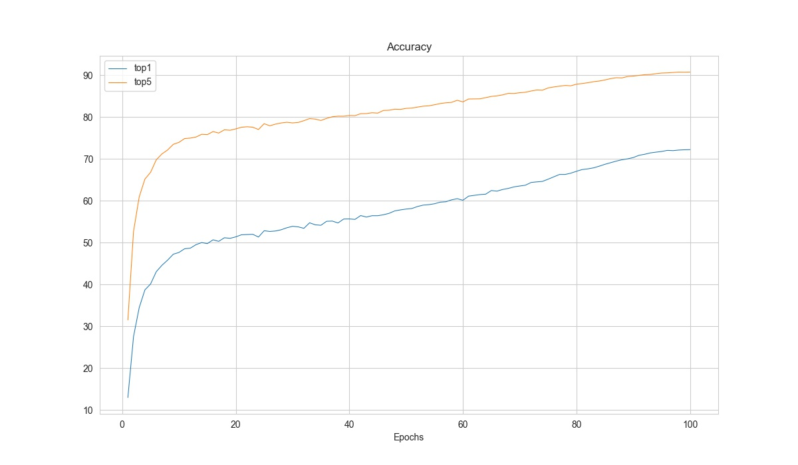

# Analysis

<!-- TOC -->

- [Log Analysis](#log-analysis)
- [Model Complexity](#model-complexity)

<!-- TOC -->

## Log Analysis

### Plot Curves

`tools/analysis/analyze_logs.py` plots loss/top-k acc curves given a training log file. Run `pip install seaborn` first to install the dependency.

<div align=center></div>

```shell
python tools/analysis/analyze_logs.py plot_curve  \
    ${JSON_LOGS}                       \
    [--keys ${KEYS}]                   \
    [--title ${TITLE}]                 \
    [--legend ${LEGEND}]               \
    [--backend ${BACKEND}]             \
    [--style ${STYLE}]                 \
    [--out ${OUT_FILE}]                \
    [--window-size ${WINDOW_SIZE}]
```

**Description of all arguments**：

- `json_logs` : The paths of configs, multiple logs are feasible, separated by spaces.
- `--keys` : The key fields of the logs to analyse, multiple logs are feasible, separated by spaces. Default to be `['loss']`.
- `--title` : The title of picture, default to be None。
- `--legend` : The names of legend, the number of which must be equal to `len(${JSON_LOGS}) * len(${KEYS})`. Default to be "${JSON_LOG}-${KEYS}".
- `--backend` : The backend of `plt`.
- `--style` : The style of `plt`, default to be `whitegrid`.
- `--out` : The path of the output picture, default not to save.
- `--window-size`: The shape of the display window. If not specified, it will be set to `12*7`. If used, it must be in the format `'W*H'`.

Examples:

- Plot the loss of some run.

    ```shell
    python tools/analysis/analyze_logs.py plot_curve log.json --keys loss --legend loss
    ```

- Plot the top-1 acc and top-5 acc of some run, and save the figure to results.jpg.

    ```shell
    python tools/analysis/analyze_logs.py plot_curve log.json --keys accuracy_top-1 accuracy_top-5  --legend top1 top5 --out results.jpg
    ```

- Compare the top-1 acc of two runs in the same figure.

    ```shell
    python tools/analysis/analyze_logs.py plot_curve log1.json log2.json --keys accuracy_top-1 --legend run1 run2
    ```

### Statistics Time

    ```shell
    python tools/analysis/analyze_logs.py cal_train_time \
        ${JSON_LOGS}
        [--include-outliers]
    ```
**Description of all arguments**

- `json_logs` ：The paths of configs, multiple logs are feasible, separated by spaces.
- `--include-outliers` ：Whether to count the records of the first epoch, default not.


Example:

    ```shell
    python tools/analysis/analyze_logs.py cal_train_time work_dirs/some_exp/20200422_153324.log.json
    ```

    The output is expected to be like the following.

    ```text
    -----Analyze train time of work_dirs/some_exp/20200422_153324.log.json-----
    slowest epoch 68, average time is 0.3818
    fastest epoch 1, average time is 0.3694
    time std over epochs is 0.0020
    average iter time: 0.3777 s/iter
    ```

## Model Complexity

### Get the FLOPs and params (experimental)

We provide a script adapted from [flops-counter.pytorch](https://github.com/sovrasov/flops-counter.pytorch) to compute the FLOPs and params of a given model.

```shell
python tools/analysis/get_flops.py ${CONFIG_FILE} [--shape ${INPUT_SHAPE}]
```

You will get the result like this.

```
==============================
Input shape: (3, 224, 224)
Flops: 4.12 GFLOPs
Params: 25.56 M
==============================
```

```{warning}
This tool is still experimental and we do not guarantee that the number is correct. You may well use the result for simple comparisons, but double check it before you adopt it in technical reports or papers.
- FLOPs are related to the input shape while parameters are not. The default input shape is (1, 3, 224, 224).
- Some operators are not counted into FLOPs like GN and custom operators. Refer to [`mmcv.cnn.get_model_complexity_info()`](https://github.com/open-mmlab/mmcv/blob/master/mmcv/cnn/utils/flops_counter.py) for details.
```
