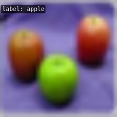

# Visualization

<!-- TOC -->

- [Visualization](#visualization)
  - [Pipeline Visualization](#pipeline-visualization)
    - [Usage](#usage)
  - [FAQs](#faqs)

<!-- TOC -->
## pipeline visualization

### Usage

```bash
python tools/visualizations/vis_pipeline.py \
    ${CONFIG_FILE} \
    --output-dir ${OUTPUT_DIR} \
    --phase ${DATASET_PHASE} \
    --number ${BUNBER_IMAGES_DISPLAY} \
    --skip-type ${SKIP_TRANSFORM_TYPE}
    --mode ${DISPLAY_MODE} \
    --show \
    --adaptive \
    --min-edge-length ${MIN_EDGE_LENGTH} \
    --max-edge-length ${MAX_EDGE_LENGTH} \
    --bgr2rgb \
    --window-size ${WINDOW_SIZE}
```

**Description of all arguments**：

- `config` : The path of a model config file.
- `--output-dir`: The output path for visualized images. If not specified, it will be set to `''`, which means not to save.
- `--phase`: Phase of visualizing dataset，must be one of `[train, val, test]`. If not specified, it will be set to `train`.
- `--number`: The number of samples to visualize. If not specified, display all images in the dataset.
- `--skip-type`: The pipelines to be skipped. If not specified, it will be set to `['ToTensor', 'Normalize', 'ImageToTensor', 'Collect']`.
- `--mode`: The display mode, can be one of `[original, pipeline, concat]`. If not specified, it will be set to `concat`.
- `--show`: If set, display pictures in pop-up windows.
- `--adaptive`: If set, automatically adjust the size of the visualization images.
- `--min-edge-length`: The minimum edge length, used when `--adaptive` is set. When any side of the picture is smaller than `${MIN_EDGE_LENGTH}`, the picture will be enlarged while keeping the aspect ratio unchanged, and the short side will be aligned to `${MIN_EDGE_LENGTH}`. If not specified, it will be set to 200.
- `--max-edge-length`: The maximum edge length, used when `--adaptive` is set. When any side of the picture is larger than `${MAX_EDGE_LENGTH}`, the picture will be reduced while keeping the aspect ratio unchanged, and the long side will be aligned to `${MAX_EDGE_LENGTH}`. If not specified, it will be set to 1000.
- `--bgr2rgb`: If set, flip the color channel order of images.
- `--window-size`: The shape of the display window. If not specified, it will be set to `12*7`. If used, it must be in the format `'W*H'`.

```{note}

1. If the `--mode` is not specified, it will be set to `concat` as default, get the pictures stitched together by original pictures and transformed pictures; if the `--mode` is set to `original`, get the original pictures; if the `--mode` is set to `pipeline`, get the transformed pictures.

2. When `--adaptive` option is set, images that are too large or too small will be automatically adjusted, you can use `--min-edge-length` and `--max-edge-length` to set the adjust size.
```

**Examples**：

1. Visualize all the transformed pictures of the `ImageNet` training set and display them in pop-up windows：

```shell
python ./tools/visualizations/vis_pipeline.py ./configs/resnet/resnet50_b32x8_imagenet.py --show --mode pipeline
```

<div align=center></div>

2. Visualize 10 comparison pictures in the `ImageNet` train set and save them in the `./tmp` folder：

```shell
python ./tools/visualizations/vis_pipeline.py configs/swin_transformer/swin_base_224_b16x64_300e_imagenet.py --phase train --output-dir tmp --number 10 --adaptive
```

<div align=center></div>

3. Visualize 100 original pictures in the `CIFAR100` validation set, then display and save them in the `./tmp` folder：

```shell
python ./tools/visualizations/vis_pipeline.py configs/resnet/resnet50_b16x8_cifar100.py --phase val --output-dir tmp --mode original --number 100  --show --adaptive --bgr2rgb
```

<div align=center></div>

## FAQs

- None
