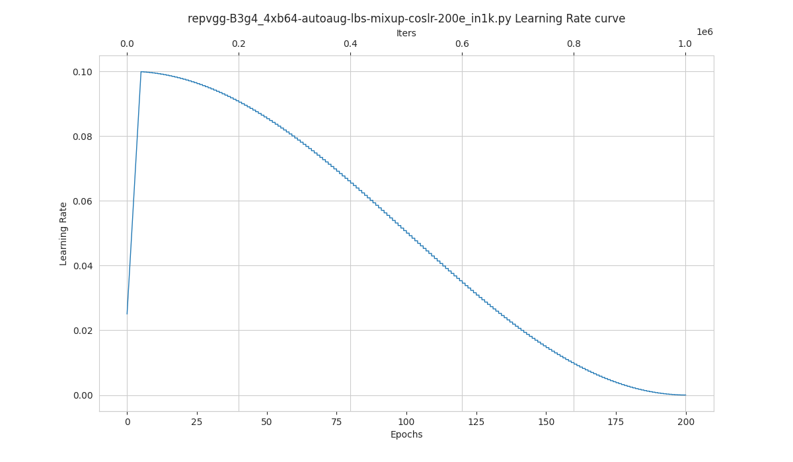

# 可视化工具（待更新）

<!-- TOC -->

- [浏览数据集](#浏览数据集)
- [学习率策略可视化](#学习率策略可视化)
- [类别激活图可视化](#类别激活图可视化)
- [常见问题](#常见问题)

<!-- TOC -->

## 浏览数据集

```bash
python tools/visualizations/browse_dataset.py \
    ${CONFIG_FILE} \
    [--output-dir ${OUTPUT_DIR}] \
    [--phase ${DATASET_PHASE}] \
    [--show-number ${NUMBER_IMAGES_DISPLAY}] \
    [--show-interval ${SHOW-INTERRVAL}] \
    [--mode ${DISPLAY_MODE}] \
    [--bgr2rgb]
    [--rescale-factor ${RESCALE-FACTOR}] \
    [--cfg-options ${CFG_OPTIONS}]
```

**所有参数的说明**：

- `config` : 模型配置文件的路径。
- `--output-dir`: 保存图片文件夹，如果没有指定，默认为 `''`,表示不保存。
- **`--phase`**: 可视化数据集的阶段，只能为 `['train', 'val', 'test']` 之一，默认为 `'train'`。
- **`--show-number`**: 可视化样本数量。如果没有指定，默认展示数据集的所有图片。
- `--show-interval`: 浏览时，每张图片的停留间隔，单位为秒。
- **`--mode`**: 可视化的模式，只能为 `['original', 'transformed', 'concat', 'pipeline']` 之一。 默认为`'transformed'`.
- **`--rescale-factor`**: 对可视化图片的放缩倍数，在图片过大或过小时设置。
- `--bgr2rgb`: 将图片的颜色通道翻转。
- `--cfg-options` : 对配置文件的修改，参考[学习配置文件](./config.html)。

```{note}

1. `--mode` 用于设置可视化的模式，默认设置为 'transformed'。
- 如果 `--mode` 设置为 'original'，则获取原始图片；
- 如果 `--mode` 设置为 'transformed'，则获取预处理后的图片；
- 如果 `--mode` 设置为 'concat'，获取原始图片和预处理后图片拼接的图片；
- 如果 `--mode` 设置为 'pipeline'，则获得数据流水线所有中间过程图片。

2. `--rescale-factor` 在数据集中图片的分辨率过大或者过小时设置。比如在可视化 CIFAR 数据集时，由于图片的分辨率非常小，可将 `--rescale-factor` 设置为 10。
```

**示例**：

1. **'original'** 模式 ：

```shell
python ./tools/visualizations/browse_dataset.py ./configs/resnet/ --phase val --output-dir tmp --mode original --show-number 100 --rescale-factor 10 --bgr2rgb
```

<div align=center></div>

2. **'transformed'** 模式 ：

```shell
python ./tools/visualizations/browse_dataset.py ./configs/resnet/resnet50_8xb32_in1k.py --show-number 100 --rescale-factor 2
```

<div align=center></div>

3. **'concat'** 模式 ：

```shell
python ./tools/visualizations/browse_dataset.py configs/swin_transformer/swin-small_16xb64_in1k.py --show-number 10 --output-dir tmp  --mode concat
```

<div align=center></div>

4. **'pipeline'** 模式 ：

```shell
python ./tools/visualizations/browse_dataset.py configs/swin_transformer/swin-small_16xb64_in1k.py --mode pipeline
```

<div align=center></div>

## 学习率策略可视化

```bash
python tools/visualizations/vis_lr.py \
    ${CONFIG_FILE} \
    [--dataset-size ${Dataset_Size}] \
    [--ngpus ${NUM_GPUs}] \
    [--save-path ${SAVE_PATH}] \
    [--title ${TITLE}] \
    [--style ${STYLE}] \
    [--window-size ${WINDOW_SIZE}] \
    [--cfg-options ${CFG_OPTIONS}] \
```

**所有参数的说明**：

- `config` : 模型配置文件的路径。
- `--dataset-size` : 数据集的大小。如果指定，`build_dataset` 将被跳过并使用这个大小作为数据集大小，默认使用 `build_dataset` 所得数据集的大小。
- `--ngpus` : 使用 GPU 的数量。
- `--save-path` : 保存的可视化图片的路径，默认不保存。
- `--title` : 可视化图片的标题，默认为配置文件名。
- `--style` : 可视化图片的风格，默认为 `whitegrid`。
- `--window-size`: 可视化窗口大小，如果没有指定，默认为 `12*7`。如果需要指定，按照格式 `'W*H'`。
- `--cfg-options` : 对配置文件的修改，参考[教程 1：如何编写配置文件](https://mmclassification.readthedocs.io/zh_CN/latest/tutorials/config.html)。

```{note}

部分数据集在解析标注阶段比较耗时，可直接将 `dataset-size` 指定数据集的大小，以节约时间。

```

**示例**：

```bash
python tools/visualizations/vis_lr.py configs/resnet/resnet50_b16x8_cifar100.py
```

<div align=center></div>

当数据集为 ImageNet 时，通过直接指定数据集大小来节约时间，并保存图片：

```bash
python tools/visualizations/vis_lr.py configs/repvgg/repvgg-B3g4_4xb64-autoaug-lbs-mixup-coslr-200e_in1k.py --dataset-size 1281167 --ngpus 4 --save-path ./repvgg-B3g4_4xb64-lr.jpg
```

<div align=center></div>

## 类别激活图可视化

MMClassification 提供 `tools\visualizations\vis_cam.py` 工具来可视化类别激活图。请使用 `pip install "grad-cam>=1.3.6"` 安装依赖的 [pytorch-grad-cam](https://github.com/jacobgil/pytorch-grad-cam)。

目前支持的方法有：

|    Method    |                                           What it does                                            |
| :----------: | :-----------------------------------------------------------------------------------------------: |
|   GradCAM    |                                  使用平均梯度对 2D 激活进行加权                                   |
|  GradCAM++   |                                  类似 GradCAM，但使用了二阶梯度                                   |
|   XGradCAM   |                         类似 GradCAM，但通过归一化的激活对梯度进行了加权                          |
|   EigenCAM   |                     使用 2D 激活的第一主成分（无法区分类别，但效果似乎不错）                      |
| EigenGradCAM | 类似 EigenCAM，但支持类别区分，使用了激活 * 梯度的第一主成分，看起来和 GradCAM 差不多，但是更干净 |
|   LayerCAM   |                        使用正梯度对激活进行空间加权，对于浅层有更好的效果                         |

**命令行**：

```bash
python tools/visualizations/vis_cam.py \
    ${IMG} \
    ${CONFIG_FILE} \
    ${CHECKPOINT} \
    [--target-layers ${TARGET-LAYERS}] \
    [--preview-model] \
    [--method ${METHOD}] \
    [--target-category ${TARGET-CATEGORY}] \
    [--save-path ${SAVE_PATH}] \
    [--vit-like] \
    [--num-extra-tokens ${NUM-EXTRA-TOKENS}]
    [--aug_smooth] \
    [--eigen_smooth] \
    [--device ${DEVICE}] \
    [--cfg-options ${CFG-OPTIONS}]
```

**所有参数的说明**：

- `img`：目标图片路径。
- `config`：模型配置文件的路径。
- `checkpoint`：权重路径。
- `--target-layers`：所查看的网络层名称，可输入一个或者多个网络层, 如果不设置，将使用最后一个`block`中的`norm`层。
- `--preview-model`：是否查看模型所有网络层。
- `--method`：类别激活图图可视化的方法，目前支持 `GradCAM`, `GradCAM++`, `XGradCAM`, `EigenCAM`, `EigenGradCAM`, `LayerCAM`，不区分大小写。如果不设置，默认为 `GradCAM`。
- `--target-category`：查看的目标类别，如果不设置，使用模型检测出来的类别做为目标类别。
- `--save-path`：保存的可视化图片的路径，默认不保存。
- `--eigen-smooth`：是否使用主成分降低噪音，默认不开启。
- `--vit-like`: 是否为 `ViT` 类似的 Transformer-based 网络
- `--num-extra-tokens`: `ViT` 类网络的额外的 tokens 通道数，默认使用主干网络的 `num_extra_tokens`。
- `--aug-smooth`：是否使用测试时增强
- `--device`：使用的计算设备，如果不设置，默认为'cpu'。
- `--cfg-options`：对配置文件的修改，参考[教程 1：如何编写配置文件](https://mmclassification.readthedocs.io/zh_CN/latest/tutorials/config.html)。

```{note}
在指定 `--target-layers` 时，如果不知道模型有哪些网络层，可使用命令行添加 `--preview-model` 查看所有网络层名称；
```

**示例（CNN）**：

`--target-layers` 在 `Resnet-50` 中的一些示例如下:

- `'backbone.layer4'`，表示第四个 `ResLayer` 层的输出。
- `'backbone.layer4.2'` 表示第四个 `ResLayer` 层中第三个 `BottleNeck` 块的输出。
- `'backbone.layer4.2.conv1'` 表示上述 `BottleNeck` 块中 `conv1` 层的输出。

```{note}
对于 `ModuleList` 或者 `Sequential` 类型的网络层，可以直接使用索引的方式指定子模块。比如 `backbone.layer4[-1]` 和 `backbone.layer4.2` 是相同的，因为 `layer4` 是一个拥有三个子模块的 `Sequential`。
```

1. 使用不同方法可视化 `ResNet50`，默认 `target-category` 为模型检测的结果，使用默认推导的 `target-layers`。

   ```shell
   python tools/visualizations/vis_cam.py \
       demo/bird.JPEG \
       configs/resnet/resnet50_8xb32_in1k.py \
       https://download.openmmlab.com/mmclassification/v0/resnet/resnet50_batch256_imagenet_20200708-cfb998bf.pth \
       --method GradCAM
       # GradCAM++, XGradCAM, EigenCAM, EigenGradCAM, LayerCAM
   ```

   | Image                                | GradCAM                                 | GradCAM++                                 | EigenGradCAM                                 | LayerCAM                                 |
   | ------------------------------------ | --------------------------------------- | ----------------------------------------- | -------------------------------------------- | ---------------------------------------- |
   | <div align=center></div> | <div align=center></div> | <div align=center></div> | <div align=center></div> | <div align=center></div> |

2. 同一张图不同类别的激活图效果图，在 `ImageNet` 数据集中，类别238为 'Greater Swiss Mountain dog'，类别281为 'tabby, tabby cat'。

   ```shell
   python tools/visualizations/vis_cam.py \
       demo/cat-dog.png configs/resnet/resnet50_8xb32_in1k.py \
       https://download.openmmlab.com/mmclassification/v0/resnet/resnet50_batch256_imagenet_20200708-cfb998bf.pth \
       --target-layers 'backbone.layer4.2' \
       --method GradCAM \
       --target-category 238
       # --target-category 281
   ```

   | Category | Image                                          | GradCAM                                          | XGradCAM                                          | LayerCAM                                          |
   | -------- | ---------------------------------------------- | ------------------------------------------------ | ------------------------------------------------- | ------------------------------------------------- |
   | Dog      | <div align=center></div> | <div align=center></div> | <div align=center></div> | <div align=center></div> |
   | Cat      | <div align=center></div> | <div align=center></div> | <div align=center></div> | <div align=center></div> |

3. 使用 `--eigen-smooth` 以及 `--aug-smooth` 获取更好的可视化效果。

   ```shell
   python tools/visualizations/vis_cam.py \
       demo/dog.jpg  \
       configs/mobilenet_v3/mobilenet-v3-large_8xb32_in1k.py \
       https://download.openmmlab.com/mmclassification/v0/mobilenet_v3/convert/mobilenet_v3_large-3ea3c186.pth \
       --target-layers 'backbone.layer16' \
       --method LayerCAM \
       --eigen-smooth --aug-smooth
   ```

   | Image                                | LayerCAM                                | eigen-smooth                                | aug-smooth                                | eigen&aug                                 |
   | ------------------------------------ | --------------------------------------- | ------------------------------------------- | ----------------------------------------- | ----------------------------------------- |
   | <div align=center></div> | <div align=center></div> | <div align=center></div> | <div align=center></div> | <div align=center></div> |

**示例（Transformer）**：

`--target-layers` 在 Transformer-based 网络中的一些示例如下:

- Swin-Transformer 中：`'backbone.norm3'`
- ViT 中：`'backbone.layers[-1].ln1'`

对于 Transformer-based 的网络，比如 ViT、T2T-ViT 和 Swin-Transformer，特征是被展平的。为了绘制 CAM 图，我们需要指定 `--vit-like` 选项，从而让被展平的特征恢复方形的特征图。

除了特征被展平之外，一些类 ViT 的网络还会添加额外的 tokens。比如 ViT 和 T2T-ViT 中添加了分类 token，DeiT 中还添加了蒸馏 token。在这些网络中，分类计算在最后一个注意力模块之后就已经完成了，分类得分也只和这些额外的 tokens 有关，与特征图无关，也就是说，分类得分对这些特征图的导数为 0。因此，我们不能使用最后一个注意力模块的输出作为 CAM 绘制的目标层。

另外，为了去除这些额外的 toekns 以获得特征图，我们需要知道这些额外 tokens 的数量。MMClassification 中几乎所有 Transformer-based 的网络都拥有 `num_extra_tokens` 属性。而如果你希望将此工具应用于新的，或者第三方的网络，而且该网络没有指定 `num_extra_tokens` 属性，那么可以使用 `--num-extra-tokens` 参数手动指定其数量。

1. 对 `Swin Transformer` 使用默认 `target-layers` 进行 CAM 可视化：

   ```shell
   python tools/visualizations/vis_cam.py \
       demo/bird.JPEG  \
       configs/swin_transformer/swin-tiny_16xb64_in1k.py \
       https://download.openmmlab.com/mmclassification/v0/swin-transformer/swin_tiny_224_b16x64_300e_imagenet_20210616_090925-66df6be6.pth \
       --vit-like
   ```

2. 对 `Vision Transformer(ViT)` 进行 CAM 可视化：

   ```shell
   python tools/visualizations/vis_cam.py \
       demo/bird.JPEG  \
       configs/vision_transformer/vit-base-p16_ft-64xb64_in1k-384.py \
       https://download.openmmlab.com/mmclassification/v0/vit/finetune/vit-base-p16_in21k-pre-3rdparty_ft-64xb64_in1k-384_20210928-98e8652b.pth \
       --vit-like \
       --target-layers 'backbone.layers[-1].ln1'
   ```

3. 对 `T2T-ViT` 进行 CAM 可视化：

   ```shell
   python tools/visualizations/vis_cam.py \
       demo/bird.JPEG  \
       configs/t2t_vit/t2t-vit-t-14_8xb64_in1k.py \
       https://download.openmmlab.com/mmclassification/v0/t2t-vit/t2t-vit-t-14_3rdparty_8xb64_in1k_20210928-b7c09b62.pth \
       --vit-like \
       --target-layers 'backbone.encoder[-1].ln1'
   ```

| Image                                   | ResNet50                                   | ViT                                    | Swin                                    | T2T-ViT                                    |
| --------------------------------------- | ------------------------------------------ | -------------------------------------- | --------------------------------------- | ------------------------------------------ |
| <div align=center></div> | <div align=center></div> | <div align=center></div> | <div align=center></div> | <div align=center></div> |

## 常见问题

- 无
