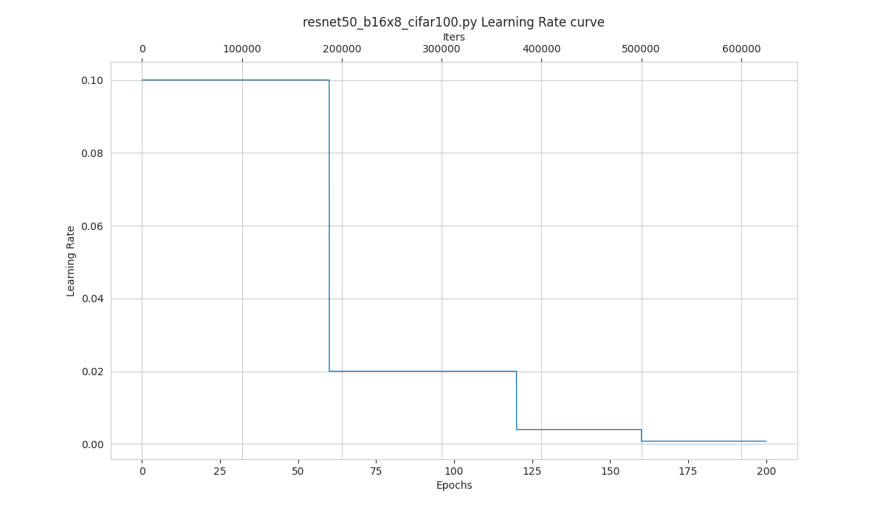
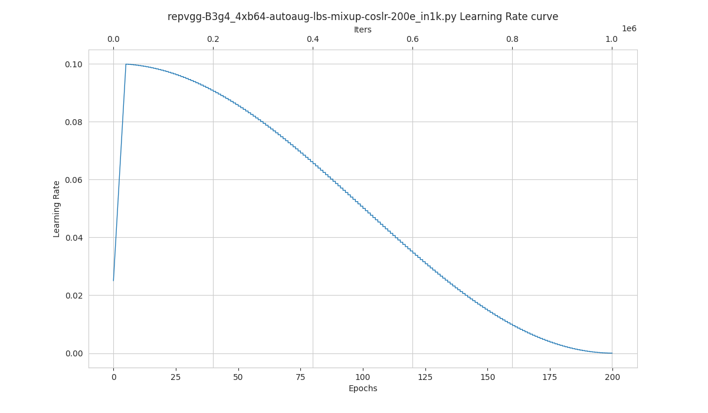

# 可视化

<!-- TOC -->

- [可视化](#可视化)
  - [数据流水线可视化](#数据流水线可视化)
  - [学习率策略可视化](#学习率策略可视化)
  - [Grad-CAM可视化](#grad-cam可视化)
  - [常见问题](#常见问题)

<!-- TOC -->

## 数据流水线可视化

```bash
python tools/visualizations/vis_pipeline.py \
    ${CONFIG_FILE} \
    --output-dir ${OUTPUT_DIR} \
    --phase ${DATASET_PHASE} \
    --number ${BUNBER_IMAGES_DISPLAY} \
    --skip-type ${SKIP_TRANSFORM_TYPE} \
    --mode ${DISPLAY_MODE} \
    --show \
    --adaptive \
    --min-edge-length ${MIN_EDGE_LENGTH} \
    --max-edge-length ${MAX_EDGE_LENGTH} \
    --bgr2rgb \
    --window-size ${WINDOW_SIZE}
```

**所有参数的说明**：

- `config` : 模型配置文件的路径。
- `--output-dir`: 保存图片文件夹，如果没有指定，默认为 `''`,表示不保存。
- `--phase`: 可视化数据集的阶段，只能为 `[train, val, test]` 之一，默认为 `train`。
- `--number`: 可视化样本数量。如果没有指定，默认展示数据集的所有图片。
- `--skip-type`: 预设跳过的数据流水线过程。如果没有指定，默认为 `['ToTensor', 'Normalize', 'ImageToTensor', 'Collect']`。
- `--mode`: 可视化的模式，只能为 `[original, pipeline, concat]` 之一，如果没有指定，默认为 `concat`。
- `--show`: 将可视化图片以弹窗形式展示。
- `--adaptive`: 自动调节可视化图片的大小。
- `--min-edge-length`: 最短边长度，当使用了 `--adaptive` 时有效。 当图片任意边小于 `${MIN_EDGE_LENGTH}` 时，会保持长宽比不变放大图片，短边对齐至 `${MIN_EDGE_LENGTH}`，默认为200。
- `--max-edge-length`: 最长边长度，当使用了 `--adaptive` 时有效。 当图片任意边大于 `${MAX_EDGE_LENGTH}` 时，会保持长宽比不变缩小图片，短边对齐至 `${MAX_EDGE_LENGTH}`，默认为1000。
- `--bgr2rgb`: 将图片的颜色通道翻转。
- `--window-size`: 可视化窗口大小，如果没有指定，默认为 `12*7`。如果需要指定，按照格式 `'W*H'`。

```{note}

1. 如果不指定 `--mode`，默认设置为 `concat`，获取原始图片和预处理后图片拼接的图片；如果 `--mode` 设置为 `original`，则获取原始图片； 如果  `--mode` 设置为 `pipeline`，则获取预处理后的图片。

2. 当指定了 `--adaptive` 选项时，会自动的调整尺寸过大和过小的图片，你可以通过设定 `--min-edge-length` 与 `--max-edge-length` 来指定自动调整的图片尺寸。
```

**示例**：

1. 可视化 `ImageNet` 训练集的所有经过预处理的图片，并以弹窗形式显示：

```shell
python ./tools/visualizations/vis_pipeline.py ./configs/resnet/resnet50_8xb32_in1k.py --show --mode pipeline
```

<div align=center></div>

2. 可视化 `ImageNet` 训练集的10张原始图片与预处理后图片对比图，保存在 `./tmp` 文件夹下：

```shell
python ./tools/visualizations/vis_pipeline.py configs/swin_transformer/swin_base_224_b16x64_300e_imagenet.py --phase train --output-dir tmp --number 10 --adaptive
```

<div align=center></div>

3. 可视化 `CIFAR100` 验证集中的100张原始图片，显示并保存在 `./tmp` 文件夹下：

```shell
python ./tools/visualizations/vis_pipeline.py configs/resnet/resnet50_8xb16_cifar100.py --phase val --output-dir tmp --mode original --number 100 --show --adaptive --bgr2rgb
```

<div align=center></div>

## 学习率策略可视化

```bash
python tools/visualizations/vis_lr.py \
    ${CONFIG_FILE} \
    --dataset-size ${Dataset_Size} \
    --ngpus ${NUM_GPUs}
    --save-path ${SAVE_PATH} \
    --title ${TITLE} \
    --style ${STYLE} \
    --window-size ${WINDOW_SIZE}
    --cfg-options
```

**所有参数的说明**：

- `config` : 模型配置文件的路径。
- `dataset-size` : 数据集的大小。如果指定，`build_dataset` 将被跳过并使用这个大小作为数据集大小，默认使用 `build_dataset` 所得数据集的大小。
- `ngpus` : 使用 GPU 的数量。
- `save-path` : 保存的可视化图片的路径，默认不保存。
- `title` : 可视化图片的标题，默认为配置文件名。
- `style` : 可视化图片的风格，默认为 `whitegrid`。
- `window-size`: 可视化窗口大小，如果没有指定，默认为 `12*7`。如果需要指定，按照格式 `'W*H'`。
- `cfg-options` : 对配置文件的修改，参考[教程 1：如何编写配置文件](https://mmclassification.readthedocs.io/zh_CN/latest/tutorials/config.html)。

```{note}

部分数据集在解析标注阶段比较耗时，可直接将 `dataset-size` 指定数据集的大小，以节约时间。

```

**示例**：

```bash
python tools/visualizations/vis_lr.py configs/resnet/resnet50_b16x8_cifar100.py
```

<div align=center></div>

当数据集为 ImageNet 时，通过直接指定数据集大小来节约时间，并保存图片：

```bash
python tools/visualizations/vis_lr.py configs/repvgg/repvgg-B3g4_4xb64-autoaug-lbs-mixup-coslr-200e_in1k.py --dataset-size 1281167 --ngpus 4 --save-path ./repvgg-B3g4_4xb64-lr.jpg
```

<div align=center></div>

## 类别激活图可视化

MMClassification 提供 `tools\visualizations\vis_cam.py` 工具来可视化类别激活图。请使用 `pip install grad-cam` 安装依赖库。工具基于 [pytorch-grad-cam](https://github.com/jacobgil/pytorch-grad-cam)。

```bash
python tools/visualizations/vis_cam.py \
    ${IMG-PATH} \
    ${CONFIG_FILE} \
    ${CHECKPOINT} \
    --target-layers ${TARGET-LAYERS} \
    [--preview-model] \
    [--cam-type ${CAM-TYPE}] \
    [--target-category ${TARGET-CATEGORY}] \
    [--save-path ${SAVE_PATH}] \
    [--aug_smooth] \
    [--eigen_smooth] \
    [--device ${DEVICE}] \
    [--cfg-options ${CFG-OPTIONS}]
```

**所有参数的说明**：

- `img`：目标图片路径。
- `config`：模型配置文件的路径。
- `checkpoint`：权重路径。
- `--target-layers`：所查看的网络层名称，可输入一个或者多个网络层名称。
- `--preview-model`：是否查看模型有哪些网络层。
- `--cam-type`：热力图可视化的算法名称，目前支持 ['GradCAM', 'ScoreCAM', 'GradCAM++', 'AblationCAM', 'XGradCAM', 'EigenCAM', 'EigenGradCAM', 'LayerCAM', 'FullGrad']，(不区分大小写)，如果不设置，默认为 'GradCAM'。
- `--target-category`：查看的目标类别，如果不设置，使用模型检测出来的类别做为目标类别。
- `--save-path`：保存的可视化图片的路径，默认不保存。
- `--aug_smooth`：是否开启测试时增强以平滑热力图，默认不开启。
- `--eigen_smooth`：是否使用主成分降低噪音， 默认不开启。
- `--device`：使用的计算设备，如果不设置，默认为'cpu'。
- `--cfg-options`：对配置文件的修改，参考[教程 1：如何编写配置文件](https://mmclassification.readthedocs.io/zh_CN/latest/tutorials/config.html)。

```{note}
1. 不知道模型中有哪些层，可以在命令行中添加 '--preview-model' 查看网络各层名称；
2. 'target-layers' 都是以 'model'开始，不能以 'relu' 为结尾。例如可以为 'model.backbone.layer4' 或者 'model.backbone.layer4.1.conv'；
3. Transformer 类的网络，如 `Swin`, `ViT` 等，'target-layers' 需要设置为xxxx;
4. `--aug_smooth` 以及 `--aug_smooth` 可以平滑噪音。
```

**示例**：

1. 使用 `GradCAM++` 算法 `可视化 `ResNet50` 的 `layer4`，默认 `target-category` 为模型结果类别。

```shell
python tools/visualizations/vis_cam.py demo\demo.JPEG configs\resnet\resnet50_8xb32_in1k.py \
    https://download.openmmlab.com/mmclassification/v0/resnet/resnet50_batch256_imagenet_20200708-cfb998bf.pth \
    --target-layers model.backbone.layer4 \
    --cam-type GradCAM++
```

2. 对 `Swin` 或者 `ViT` 的可视化。

```shell
python tools/visualizations/vis_cam.py demo\demo.JPEG  \
    configs/swin_transformer/swin-tiny_16xb64_in1k.py \
    https://download.openmmlab.com/mmclassification/v0/swin-transformer/swin_tiny_224_b16x64_300e_imagenet_20210616_090925-66df6be6.pth \
    --target-layers model.backbone.layer4 \
    --cam-type ablationcam
```

3. 使用 `--aug_smooth` 以及 `--aug_smooth` 平滑噪音。

```shell
python tools/visualizations/vis_cam.py demo\demo.JPEG  \
    configs\mobilenet_v3\mobilenet-v3-large_8xb32_in1k.py \
    https://download.openmmlab.com/mmclassification/v0/mobilenet_v3/convert/mobilenet_v3_large-3ea3c186.pth \
    --target-layers model.backbone.layer4 \
    --aug_smooth --aug_smooth
```

## 常见问题

- 无
